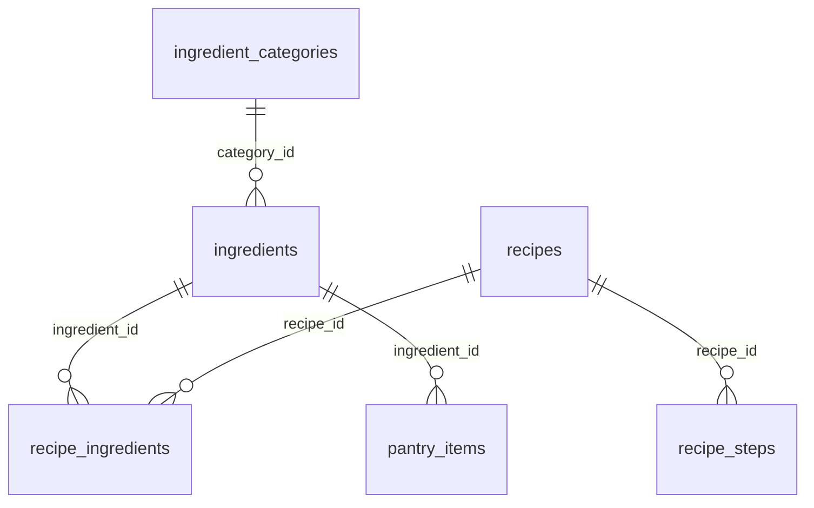

# Tài liệu mô tả Cơ sở dữ liệu NCKH (`nckh`)

Tài liệu mô tả schema MySQL/MariaDB của dự án NCKH — hệ thống gợi ý món ăn Việt Nam. Dữ liệu công thức được chuẩn hóa từ `app/schemas/ingredient_task/data_book.json` (96 món, 47 nguyên liệu độc nhất).

---

## 1. Tổng quan

| Thông tin | Giá trị |
|-----------|---------|
| Tên database | `nckh` |
| Engine | InnoDB |
| Charset | `utf8mb4` / `utf8mb4_unicode_ci` |
| Nguồn dữ liệu chính | `data_book.json` |
| File dump SQL | `be_nckh/database.sql` |
| Backup tự động | `be_nckh/backups/nckh_YYYYMMDD_HHMMSS.sql` |

### Thống kê sau migration (2026-06-27)

| Bảng | Số bản ghi |
|------|------------|
| `recipes` | 96 |
| `ingredients` | 47 |
| `recipe_ingredients` | 498 |
| `recipe_steps` | 148 |
| `ingredient_categories` | 5 |

---

## 2. Sơ đồ quan hệ (ERD)



---

## 3. Ánh xạ `data_book.json` → Database

Dữ liệu JSON được ánh xạ trực tiếp sang các bảng SQL. Các trường không có trong JSON được giữ lại phục vụ ứng dụng (ví dụ: `is_featured`, `total_views`).

### 3.1. Công thức (`recipes`)

| Trường JSON | Cột SQL | Kiểu | Ghi chú |
|-------------|---------|------|---------|
| `name` | `name` | VARCHAR(200) | Tên món |
| `description` | `description` | TEXT | Mô tả ngắn |
| `image_url` | `image_url` | TEXT | Đường dẫn ảnh tương đối, vd. `images/thit_bo_nau_sot_vang.jpg` |
| `cook_time_minutes` | `cook_time_minutes` | INT | Phút nấu; mặc định 30 nếu null |
| `difficulty` | `difficulty` | VARCHAR(20) | `easy` / `medium` / `hard` |
| `servings` | `servings` | INT | Khẩu phần |
| `cuisine_type` | `cuisine_type` | VARCHAR(50) | Luôn `Vietnamese` |
| `diet_tags` | `diet_tags` | JSON | Mảng nhãn, vd. `["Món mặn", "Canh"]` |
| `source` | `source` | TEXT | **Mới** — trích dẫn sách nguồn |
| — | `id` | VARCHAR(36) | `recipe-book-0001` … `recipe-book-0096` |

### 3.2. Nguyên liệu trong công thức (`recipe_ingredients`)

| Trường JSON | Cột SQL | Kiểu | Ghi chú |
|-------------|---------|------|---------|
| `name` | → `ingredients.name` | — | Tra cứu bảng master `ingredients` |
| `quantity` | `quantity` | VARCHAR(50) | Số lượng |
| `unit` | `unit` | VARCHAR(50) | Đơn vị (gram, ml, quả…) |
| `is_optional` | `is_optional` | TINYINT(1) | Nguyên liệu tùy chọn |
| — | `sort_order` | INT | Thứ tự hiển thị |

### 3.3. Hướng dẫn nấu (`recipe_steps`)

| Trường JSON (`instructions[]`) | Cột SQL | Kiểu |
|--------------------------------|---------|------|
| `step_number` | `step_number` | INT |
| `title` | `title` | VARCHAR(200) |
| `description` | `description` | TEXT |
| `tip` | `tip` | TEXT |

### 3.4. Danh mục nguyên liệu (`ingredient_categories`)

| `category_id` JSON | Tên | Slug |
|--------------------|-----|------|
| `c1` | Thịt cá | `thit-ca` |
| `c2` | Trứng sữa | `trung-sua` |
| `c3` | Rau củ | `rau-cu` |
| `c4` | Tinh bột | `tinh-bot` |
| `c5` | Gia vị | `gia-vi` |

### 3.5. Nguyên liệu master (`ingredients`)

Mỗi tên nguyên liệu duy nhất trong `data_book.json` tạo một bản ghi:

| Cột | Nguồn |
|-----|-------|
| `name` | `ingredients[].name` |
| `category_id` | `ingredients[].category_id` |
| `image_url` | Tự sinh: `images/{slug_tên}.jpg` |
| `icon` | Emoji theo category (🍗/🥚/🥬/🍚/🧂) |
| `id` | `ing-book-0001` … |

---

## 4. Bảng vận hành (giữ lại, không từ data_book)

| Bảng | Mục đích |
|------|----------|
| `pantry_items` | Tủ lạnh người dùng (user_id, ingredient_id, quantity) |
| `scan_sessions` | Lịch sử quét ảnh nhận diện nguyên liệu (YOLO/ResNet) |

Sau migration, dữ liệu demo trong hai bảng này được xóa vì tham chiếu ID nguyên liệu cũ không còn hợp lệ.

---

## 5. Thay đổi so với database cũ

| Hạng mục | Database cũ | Database mới |
|----------|-------------|--------------|
| Nguồn công thức | Cookpad crawl (21 món) | Sách nấu ăn VN (96 món) |
| `recipes.source` | Không có | Có — trích dẫn sách |
| `recipe_ingredients.quantity` / `unit` | `"to taste"` | `"500"` + `"gram"`, `"3"` + `"quả"`… |
| `ingredients` | ~100+ (Cookpad) | 47 (chuẩn hóa từ data_book) |
| ID prefix | `recipe-seed-*`, `ing-seed-*` | `recipe-book-*`, `ing-book-*` |

---

## 6. Hướng dẫn sử dụng

### 6.1. Migration / seed lại từ data_book.json

```powershell
cd be_nckh
.venv\Scripts\activate
$env:PYTHONUTF8=1
python migrate_data_book.py
```

Script sẽ:
1. Thêm cột mới nếu chưa có (`source`, `quantity`, `unit`)
2. Xóa dữ liệu cũ (recipes, ingredients, pantry demo, scan demo)
3. Seed 96 công thức từ `data_book.json`
4. Export `database.sql` và bản backup vào `backups/`

Bỏ qua export: `python migrate_data_book.py --no-export`

### 6.2. Import thủ công từ file SQL

```powershell
# XAMPP
C:\xampp\mysql\bin\mysql.exe -u root nckh < be_nckh\database.sql
```

Hoặc import qua phpMyAdmin / DBeaver.

### 6.3. Đồng bộ Vector DB (RAG) sau migration

```powershell
cd food-ai-service
.venv\Scripts\activate
python seed_vector_db.py
```

### 6.4. Cấu hình kết nối

```env
DATABASE_URL=mysql+pymysql://root:@localhost:3306/nckh
```

---

## 7. Ví truy vấn SQL hữu ích

```sql
-- Xem công thức kèm nguyên liệu
SELECT r.name, ri.quantity, ri.unit, i.name AS ingredient
FROM recipes r
JOIN recipe_ingredients ri ON ri.recipe_id = r.id
JOIN ingredients i ON i.id = ri.ingredient_id
WHERE r.name LIKE '%sốt vang%'
ORDER BY ri.sort_order;

-- Thống kê theo nguồn sách
SELECT SUBSTRING_INDEX(source, ',', 1) AS book, COUNT(*) AS cnt
FROM recipes
GROUP BY book
ORDER BY cnt DESC;

-- Món theo độ khó
SELECT difficulty, COUNT(*) FROM recipes GROUP BY difficulty;
```

---

## 8. File liên quan

| File | Mô tả |
|------|-------|
| `app/schemas/ingredient_task/data_book.json` | Nguồn dữ liệu gốc |
| `migrate_data_book.py` | Script migration |
| `database.sql` | Dump SQL mới nhất |
| `backups/` | Bản sao lưu theo timestamp |
| `app/models/recipe.py` | Model SQLAlchemy |
| `app/models/recipeIngredient.py` | Model liên kết công thức–nguyên liệu |
